# Arquitetura de Cadastros — ERP v2.2

## Objetivo

A v2.2 transforma as abas de cadastro da planilha mestre em uma fila revisável, sem substituir os cadastros operacionais atuais e sem misturar bases transacionais com cadastros.

Domínios tratados:

- empresas;
- fornecedores;
- materiais;
- locais;
- ramos;
- colaboradores.

Equipamentos, veículos e implementos permanecem reservados para a v2.3. Bases de combustível, materiais, viagens, efetivo e estacas continuam pertencendo aos respectivos módulos operacionais.

## Fluxo

```mermaid
flowchart LR
  A["Planilha mestre"] --> B["Leitura segura com ExcelJS"]
  B --> C["Separação por abas CAD"]
  C --> D["Normalização e chave canônica"]
  D --> E["Comparação com cadastros atuais"]
  E --> F["Novo, já cadastrado, duplicado ou inválido"]
  F --> G["Revisão com TanStack Table"]
  G --> H["Confirmação com React Hook Form e Zod"]
  H --> I["Gateway Netlify autenticado"]
  I --> J["Lote, linhas, aliases e fila Supabase"]
```

## Mapeamento das abas

| Aba | Entidade | Chave primária de comparação | Alternativa |
|---|---|---|---|
| `CAD_EMPRESAS` | `companies` | CNPJ normalizado | nome |
| `CAD_FORNECEDORES` | `suppliers` | CNPJ normalizado | fornecedor |
| `CAD_MATERIAIS` | `materials` | código original | descrição |
| `CAD_LOCAIS` | `locations` | local | nenhuma associação inventada |
| `CAD_RAMOS` | `work_branches` | ramo/trecho | nenhuma associação inventada |
| `CAD_COLABORADORES` | `collaborators` | matrícula | nome |

Os textos originais permanecem em `raw`. Os campos interpretados ficam em `normalized`. Nenhum valor original é substituído ou removido.

## Estados de revisão

- `ready`: chave segura e sem correspondência atual;
- `matched`: já existe um cadastro operacional com a mesma chave;
- `duplicate`: a chave aparece em mais de uma linha da planilha;
- `invalid`: falta identidade ou campo obrigatório para promoção.

Duplicados e inválidos entram na mesma fila das demais linhas. O estado impede promoção silenciosa, mas não descarta o conteúdo.

## Aliases

Variações de nome, capitalização e descrição são agrupadas pela chave canônica e preservadas em:

- `master_data_review_items.aliases`;
- `master_data_aliases`;
- `import_rows.raw_data`.

O conflito de alias usa `ON CONFLICT DO NOTHING`. Um alias existente nunca é transferido automaticamente para outra chave canônica.

## Bases postergadas

As abas fora do escopo são contadas e exibidas na interface com o motivo do adiamento. Elas não são convertidas pela v2.2 e permanecem na planilha original.

Essa decisão evita:

- importar `BASE_MATERIAIS` como cadastro;
- misturar abastecimentos com tipos de combustível;
- promover equipamentos antes do modelo de frota da v2.3;
- transformar instruções e listas auxiliares em registros de negócio.

## Fonte operacional

Os arrays existentes de empresas, obras, funcionários, materiais e ramos continuam sendo a fonte utilizada pelos módulos atuais. A v2.2 consulta essa fonte para identificar correspondências, mas não grava automaticamente sobre ela.

A fila Supabase é uma etapa de homologação. A promoção definitiva deverá ocorrer somente após decisão explícita e comparação com os módulos consumidores.

## Segurança

- token Firebase e `staff=true` continuam obrigatórios;
- a organização é definida pelo servidor;
- `admin`, `gestor` e `operador` podem preparar lotes;
- `leitura` não pode enviar importações;
- a chave `service_role` permanece somente no Netlify;
- RLS protege aliases e itens de revisão;
- exclusão direta fica restrita aos perfis de gestão.
