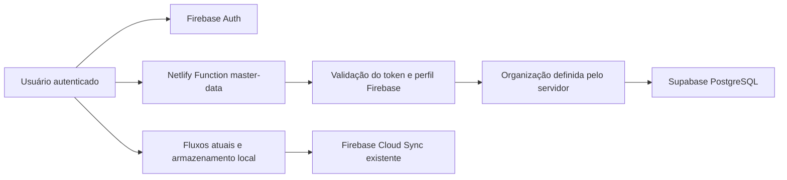

# Arquitetura de Dados — ERP v2.1

## Decisão arquitetural

O Firebase permanece como autenticação e persistência oficial dos fluxos atuais. O Supabase entra como fundação PostgreSQL opcional para cadastros mestres, importações revisáveis e auditoria estruturada.

Não há gravação dupla automática na v2.1. Isso evita divergência silenciosa enquanto cada módulo ainda está sendo homologado.

## Fonte única de verdade

A fundação define entidades independentes para:

1. organizações;
2. usuários e perfis;
3. empresas;
4. obras/locais;
5. ramos;
6. equipamentos;
7. veículos;
8. colaboradores;
9. fornecedores;
10. materiais;
11. comboios;
12. tipos de combustível;
13. lubrificantes;
14. etapas de serviço.

Fornecedores referenciam empresas, materiais referenciam fornecedores e equipamentos/veículos/colaboradores referenciam empresas. As chaves estrangeiras incluem a organização para impedir vínculos entre ambientes diferentes.

O campo `legacy_id` permite relacionar os identificadores atuais sem descartá-los. A migração futura deve manter esse vínculo até a homologação completa.

## Importações sem descarte

O fluxo previsto é:

1. criar um registro em `import_batches`;
2. preservar cada linha original em `import_rows.raw_data`;
3. classificar a linha como pendente, válida, alerta, inválida, duplicada, não mapeada ou importada;
4. registrar problemas específicos em `import_issues`;
5. promover os dados normalizados somente após validação;
6. manter o lote e a linha original para rastreabilidade.

A função `ingest_import_batch` executa os passos 1 e 2 na mesma transação e usa a ordem recebida como número interno. O número original da planilha continua dentro de `raw_data`.

## Segurança e autorização

| Perfil | Consultar | Criar/editar | Preservar importação | Arquivar |
|---|---:|---:|---:|---:|
| admin | Sim | Sim | Sim | Sim |
| gestor | Sim | Sim | Sim | Sim |
| operador | Sim | Sim | Sim | Não |
| leitura | Sim | Não | Não | Não |

O gateway:

- exige token Firebase válido e `staff=true`;
- deriva a organização da claim ou da configuração protegida do servidor;
- rejeita entidades e campos fora da lista permitida;
- valida tipos, UUIDs, tamanhos e campos obrigatórios;
- aplica arquivamento lógico;
- usa concorrência otimista opcional por `expectedUpdatedAt`;
- nunca envia a chave `service_role` ao navegador.

## Auditoria

Gatilhos registram inserções, alterações e exclusões em `audit_events`, incluindo:

- tabela;
- registro;
- operação;
- estado anterior;
- estado posterior;
- campos alterados;
- usuário responsável, quando disponível;
- claims da requisição;
- data e hora.

## Implantação gradual

Ordem recomendada:

1. aplicar a migration em ambiente de homologação;
2. cadastrar a organização;
3. validar o cartão de status em Configurações;
4. importar somente a planilha mestre para lotes de revisão;
5. homologar empresas, obras, equipamentos e colaboradores;
6. integrar leitura dos cadastros no frontend;
7. ativar escrita por um módulo piloto;
8. comparar Firebase, exportações e planilhas;
9. expandir por módulo sem desligar o legado;
10. definir corte somente após aceite operacional.

## Limites desta versão

- Nenhum dado atual é migrado automaticamente.
- Nenhum módulo operacional passou a depender do Supabase.
- O frontend possui o cliente e o diagnóstico, mas os formulários continuam usando o estado oficial existente.
- A migration foi criada para PostgreSQL/Supabase, porém precisa ser executada e homologada em um projeto real antes de produção.
